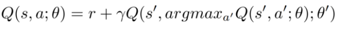
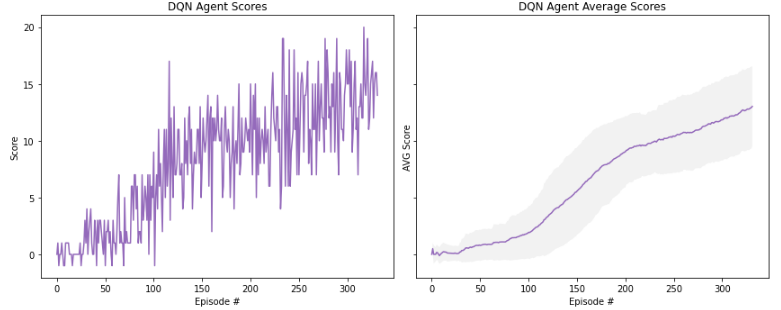

[//]: # (Image References)

[image1]: ../img/DoubleDQN_equation.png "DoubleDQN Bellman Equation"

# Navigation Report

### Introduction

The project is considered solvable if the Agent achieves a **13 Average Score** over the last 100-episodes before it reaches episode 1800.

The following implementation achieves this goal in **232 Episodes** by utilizing the `Rainbow Algorithm`. In this approach the below algorithms are used:

- Classic Deep Q-Network
- Double Deep Q-Network
- Duel Deep Q-Network
- Prioritized Experience Replay

In order to construct the Rainbow Algorithm, the Agent combines a Double DQN, Duel DQN and Prioritized Experience Replay.

### Classic DQN

For classic DQN the following Neural Network Architecture has been used:

- Input Layer: 37 Units
- Hidden Layer: 128 Units
- Hidden Layer: 64 Units
- Hidden Layer: 32 Units
- Output Layer: 4 Units

~~~python
QNetwork(
  (dqn_layers): Sequential(
    (0): Linear(in_features=37, out_features=128, bias=True)
    (1): ReLU()
    (2): Linear(in_features=128, out_features=64, bias=True)
    (3): ReLU()
    (4): Linear(in_features=64, out_features=32, bias=True)
    (5): ReLU()
    (6): Linear(in_features=32, out_features=4, bias=True)
  )
)
~~~

For every Linear Layer, a ReLU activation function follows before proceeding to the next Layer.

### Double DQN

The Double DQN uses the same NN architecture with the `Classic DQN` but the different is that during the reward estimation the **action selection and evaluation are decoupled**.

The main network is decides on the action to be used but then the target network is the one that evaluates that action. The Bellman equation below illustrates this approach.

  

### Duel DQN

The Duel DQN uses the same NN architecture with the `Classic DQN` but extends it at the final Output Layer.

During that Layer the NN splits into two different streams, one for the **Value Stream** and one for the **Advantage Stream**. The former one calculates the state value while the latter one calculates the advantage value for each action.

At the end the DQN combines those two stream to calculate the Q-values. The following architecture illustrates this implementation:

~~~python
DuelQNetwork(
  (feature_layers): Sequential(
    (0): Linear(in_features=37, out_features=128, bias=True)
    (1): ReLU()
    (2): Linear(in_features=128, out_features=64, bias=True)
    (3): ReLU()
    (4): Linear(in_features=64, out_features=32, bias=True)
    (5): ReLU()
  )
  (value_stream): Sequential(
    (0): Linear(in_features=32, out_features=1, bias=True)
  )
  (advantage_stream): Sequential(
    (0): Linear(in_features=32, out_features=4, bias=True)
  )
)
~~~

### Prioritized Experience Replay

During PER, the Agent picks experiences to replay from the buffer based on priority probabilities instead of using a uniform one. In that way the Agent is able to choose the experiences that will impact his learning the most.

### Rainbow Algorithm

The Rainbow Algorithm utilizes all the above extensions in order to enhance the Agent's performance. This algorithm is used in the current implementation and the Agent's scores are illustrated below:

  

As illustrated the Agent achieves an average score of 13 in 232 Episodes. During training of the Agent the following `Hyperparameters` were used.

#### 1. Environment Hyperparameters

- epsilon Start: 1.0
- epsilon Min: 0.01
- epsilon Decay: 0.99

#### 2. Agent Hyperparameters

- Buffer Size: 1e4
- Batch Size: 64
- Gamma: 0.99
- Tau: 1e-2
- LR: 1e-3
- Update Every: 16

#### 3. Prioritized Experience Replay Hyperparameters

- alpha: 0.6
- beta: 0.4
- beta Anneal: 1.0001
- Max Probability: 0.1
- Min Probability (constant e): 0.00001

### Idea for Future Work

- A lot effort has been put through configuring the Hyperparameters, but through additional testings the Hyperparameters can be further optimized for faster learning.

- Currently the Agent receives the environment's states through a 37D array but it would be interesting to train the Agent directy on raw Pixels.

### References
- [Human-level control through deep reinforcement learning](https://storage.googleapis.com/deepmind-media/dqn/DQNNaturePaper.pdf)
- [Deep Reinforcement Learning with Double Q-learning](https://arxiv.org/abs/1509.06461)
- [Dueling Network Architectures for Deep Reinforcement Learning](https://arxiv.org/abs/1511.06581)
- [Prioritized Experience Replay](https://arxiv.org/abs/1511.05952)
