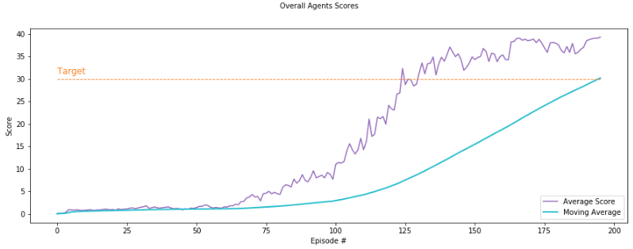

# Continuous-Control Report

### Introduction

The project is considered solvable if the Agents achieve a **30 Average Score** over the last 100-episodes.

The following implementation achieves this goal in **96 Episodes** by utilizing the `Deep Deterministic Policy Gradient (DDPG) Algorithm`. In this approach the below components are used:

- Actor Neural Network
- Critic Neural Network
- Replay Buffer
- Ornstein-Uhlenbeck Process

### Actor NN

The Actor NN is a **Policy based method** where Actions are mapped directly on input states. The Actor NN uses the following Architecture:

- Batch Normalization Layer: 33 Units
- Hidden Layer: 33 Units
- Hidden Layer: 128 Units
- Output Layer: 128 Units

~~~python
Actor(
  (bn1d): BatchNorm1d(33, eps=1e-05, momentum=0.1, affine=True, track_running_stats=True)
  (fc1): Linear(in_features=33, out_features=128, bias=True)
  (fc2): Linear(in_features=128, out_features=128, bias=True)
  (output): Linear(in_features=128, out_features=4, bias=True)
)
~~~

For every Linear Layer, a Leaky ReLU activation function follows before proceeding to the next Layer. At the end a Tanh activation is happening on the output layer.

### Critic NN

The Critic NN is a **Value based method** where Q-values are being calculated for each state. The Critic NN uses the following Architecture:

- Batch Normalization Layer: 33 Units
- Hidden Layer: 33 Units
- Hidden Layer: 132 Units
- Output Layer: 128 Units

~~~python
Critic(
  (bn1d): BatchNorm1d(33, eps=1e-05, momentum=0.1, affine=True, track_running_stats=True)
  (fc1): Linear(in_features=33, out_features=128, bias=True)
  (fc2): Linear(in_features=132, out_features=128, bias=True)
  (output): Linear(in_features=128, out_features=1, bias=True)
)
~~~

For every Linear Layer, a Leaky ReLU activation function follows before proceeding to the next Layer.

### Replay Buffer

During training, the Agent pick a batch of past experiences **at random** to learn and update its weights. In that way the Agent is not learning sequentially from experiences and the correlation among examples is avoided.

### Ornstein-Uhlenbeck Process

To facilitate **Exploration** a Noise component is added which decays over time in order to balance **Exploitation** during training.

### DDPG Algorithm

The DDPG Algorithm utilizes the Actor Network to choose an action based on a particular state and then uses the Critic network to evaluate that action and learn. The overall Agents' scores can be seen in the below graph followed by the individual Agent's scores:

  

As illustrated the Agents achieves an average score of 30 in 96 Episodes. During training of the Agent the following `Hyperparameters` were used.

#### 1. Environment Hyperparameters

- noise Start: 1.0
- noise Min: 0.01
- noise Decay: 0.995

#### 2. Agent Hyperparameters

- Buffer Size: int(1e6)
- Batch Size: 256
- Gamma: 0.99
- Tau: 1e-3
- LR_Actor: 1e-4
- LR_Critic: 1e-3
- Update Every: 2

### Idea for Future Work

- The above implementation test the DDPG algorithm agains the Continuous-Control problem but it would be interesting to implement additional algorithms that could be better. Examples of additonal algorithms that could be used are `Trust Region Policy Optimization (TRPO)`, `Truncated Natural Policy Gradient (TNPG)` and  `Distributed Distributional Deterministic Policy Gradients (D4PG)`.

- Apart from the Reacher environment there is another Challenge that uses the **Crawler** environment. It would be quite interesting to test the above implementation of this environment as well.

### References
- [Human-level control through deep reinforcement learning](https://storage.googleapis.com/deepmind-media/dqn/DQNNaturePaper.pdf)
- [Continuous control with deep reinforcement learning](https://arxiv.org/abs/1509.02971)
- [Benchmarking Deep Reinforcement Learning for Continuous Control](https://arxiv.org/abs/1604.06778)
